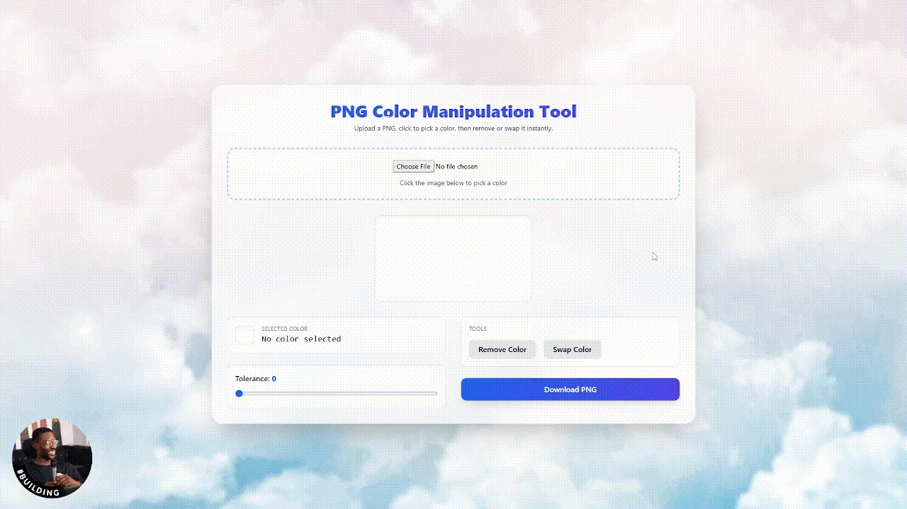

# PNG Color Manipulation Tool

A lightweight, browser-based PNG color editing tool built with **pure HTML, Tailwind CDN, and vanilla JavaScript** — no frameworks, no build tools, no backend.

Why did i build this rediculosly simple project in 15min using AI? Coz i can. 😎

It allows you to:

- Upload a PNG image
- Pick a color directly from the image
- Remove that color (make it transparent)
- Swap that color with another color
- Adjust tolerance in real-time
- Download the processed PNG with transparency preserved

---

## 📸 Demo



---

## 🚀 Features

### ✅ Image Upload
- Upload any PNG file
- Canvas automatically matches the image resolution
- All processing happens client-side

### 🎯 Color Picker
- Click anywhere on the image to select a color
- Displays:
  - HEX value
  - Live preview box
- Stores RGB internally

### 🎚 Tolerance Slider
- Range: 0–100
- Controls how closely pixels must match the selected color
- Internally mapped to RGB distance (0–441)

### 🧹 Remove Color Tool
- Makes matching pixels transparent
- Preserves existing transparency

### 🎨 Swap Color Tool
- Replace selected color with a new one
- Uses a color input picker
- Real-time preview

### ⚡ Real-Time Processing
Image updates instantly when:
- Tolerance changes
- Selected color changes
- Replacement color changes
- Tool changes

### 💾 Download
- Export final result as PNG
- Preserves transparency
- No compression artifacts

---

## 🛠 How It Works

The app uses the **HTML5 Canvas API**:

- `getImageData()` to read pixel data
- Iterates over pixels in steps of 4 (RGBA)
- Calculates RGB Euclidean distance:

```
distance = √((r1-r2)² + (g1-g2)² + (b1-b2)²)
```

- If `distance < threshold`:
  - Remove tool → set `alpha = 0`
  - Swap tool → replace RGB values

The original image data is preserved to allow clean reprocessing.

---

## 📦 Project Structure

```
.
├── index.html
├── README.md
└── .docs/
    └── demo.png
```

This is a **single-file application**:
- All CSS embedded (Tailwind CDN)
- All JavaScript embedded
- No dependencies
- No server required

---

## ▶️ Usage

1. Open `index.html` in your browser
2. Upload a PNG
3. Click on the image to select a color
4. Adjust tolerance
5. Choose:
   - **Remove Color**
   - **Swap Color**
6. Download your edited PNG

---

## 🌐 Browser Compatibility

Works in all modern browsers that support:
- HTML5 Canvas
- `getImageData`
- `putImageData`
- ES6 JavaScript

Tested in:
- Chrome
- Edge
- Firefox
- Safari

---

## 🔒 Privacy

✅ 100% client-side  
✅ No uploads to any server  
✅ No tracking  
✅ No analytics  

Your images never leave your device.

---

## 🎯 Ideal Use Cases

- Remove white backgrounds
- Remove solid-color logos
- Create transparent assets
- Replace flat UI colors
- Quick sprite editing
- Simple graphic cleanup

---

## 📄 License

Free to use and modify.